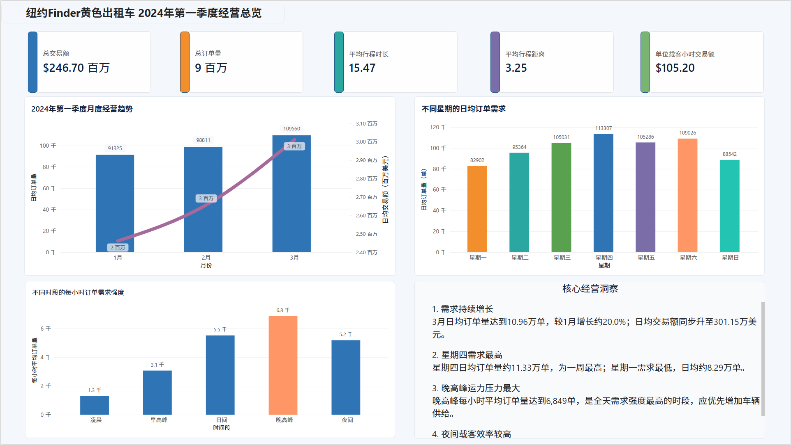

# NYC Yellow Taxi Business Analysis

## Project Overview

This project analyzes New York City Yellow Taxi trip records from
January to March 2024. The objective is to evaluate operating
performance, identify temporal demand patterns, measure regional
supply-demand imbalance, and support vehicle allocation decisions.

## Key Results

- Analyzed 9.09 million cleaned taxi trip records.
- Total transaction amount reached $246.70 million.
- Average order amount was $27.13.
- March recorded 109,560 average daily trips, approximately 20.0%
  higher than January.
- Thursday had the highest average daily demand.
- Evening peak demand reached approximately 6,849 trips per clock hour.
- JFK Airport and LaGuardia Airport were important high-value
  pickup markets.
- Significant pickup-dropoff imbalance was identified across several
  Manhattan and airport zones.

## Technology Stack

- Python
- Pandas
- NumPy
- Matplotlib
- Seaborn
- MySQL
- SQL
- Power BI
- Jupyter Notebook

## Dashboard Preview

## Analysis Workflow

1. Collected three months of NYC TLC Yellow Taxi trip records.
2. Inspected missing values, duplicate records and abnormal values.
3. Cleaned temporal, distance, speed, location and payment anomalies.
4. Designed analytical indicators and MySQL dimensional tables.
5. Conducted time, region, airport and OD-route analysis using SQL.
6. Built an interactive Power BI business dashboard.
7. Generated operational recommendations for demand scheduling and
   vehicle allocation.

## Repository Structure

- `notebooks/`: Python data processing and exploratory analysis
- `sql/`: database construction and business-analysis queries
- `dashboard/`: Power BI dashboard and preview
- `images/`: analytical visualizations
- `data/`: data source and field documentation
- `docs/`: project documentation

## Data Source

NYC Taxi & Limousine Commission Trip Record Data.

The full raw and processed data are not uploaded because of their
large size. Please refer to `data/README.md` for download instructions.

## Author

Yadong Liu
