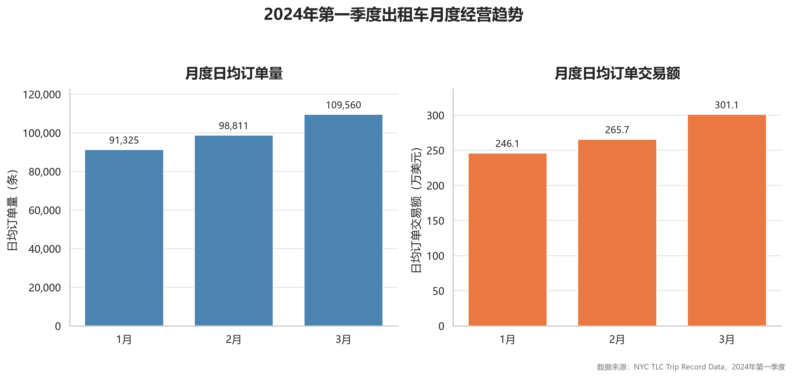
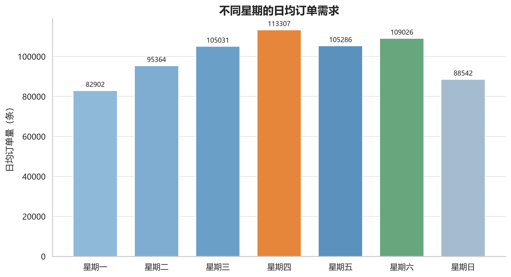
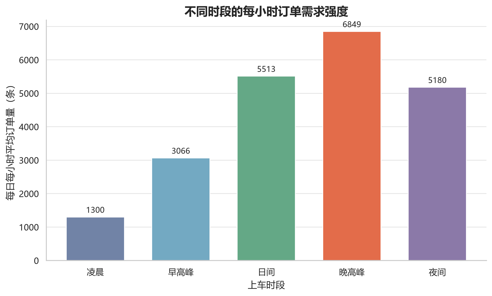
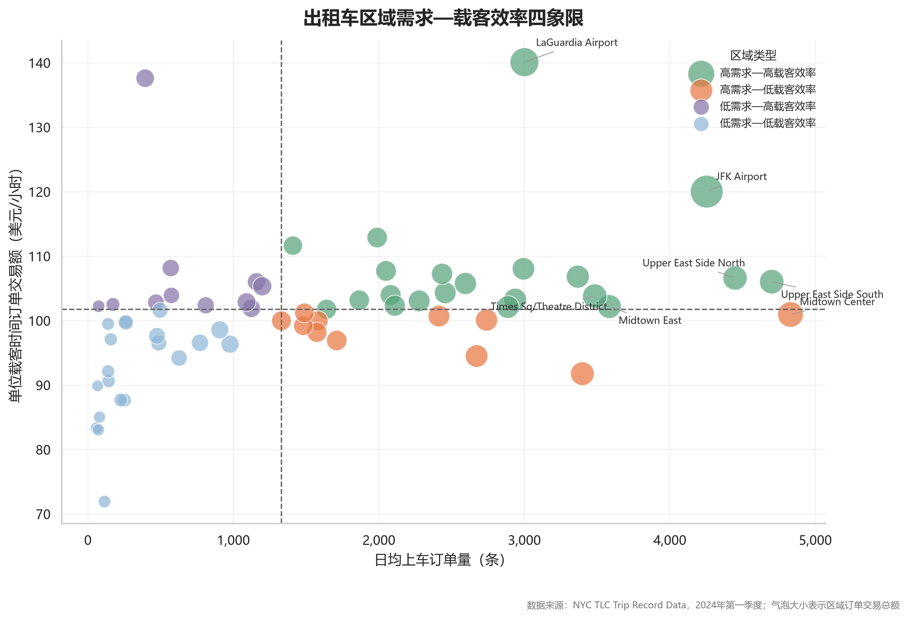

# NYC Yellow Taxi Business Analysis

> Business analysis of 9.09 million NYC Yellow Taxi trips using Python, MySQL, SQL and Power BI.

## Project Overview

This project analyzes New York City Yellow Taxi trip records from January to March 2024.

The objective is to evaluate operating performance, identify temporal demand patterns, analyze regional supply-demand imbalance, and provide data-driven recommendations for vehicle allocation and operational scheduling.

## Project Highlights

| Metric | Result |
|---|---:|
| Analysis period | January–March 2024 |
| Raw trip records | 9,554,778 |
| Cleaned trip records | 9,092,942 |
| Data retention rate | 95.17% |
| Total transaction amount | $246.70 million |
| Average order amount | $27.13 |
| Average trip distance | 3.25 miles |
| Transaction amount per occupied hour | $105.20 |

## Key Business Findings

- March recorded approximately **109,560 average daily trips**, representing an increase of about **20.0%** compared with January.
- Thursday had the highest weekday demand, with approximately **113,307 average daily trips**.
- The evening peak recorded the highest demand intensity, reaching approximately **6,849 trips per clock hour**.
- Manhattan accounted for the majority of Yellow Taxi pickup activity.
- JFK Airport and LaGuardia Airport were important high-value pickup markets.
- JFK Airport generated substantially more pickup trips than drop-off trips, indicating a potential vehicle replenishment requirement.
- Several Manhattan zones showed significant pickup-drop-off flow imbalance, providing a reference for vehicle repositioning.
- Nighttime orders generated higher transaction value per occupied hour than daytime orders, although waiting time and empty cruising time were not included.

## Technology Stack

- Python
- Pandas
- NumPy
- PyArrow
- Matplotlib
- Seaborn
- Jupyter Notebook
- MySQL
- SQL
- Power BI

## Dashboard Preview


The Power BI dashboard presents key operating indicators, monthly trends, weekday demand patterns and time-period demand intensity.

## Key Visualizations

### 1. Monthly Operating Performance



Average daily trip volume increased continuously during the first quarter of 2024. March achieved the highest average daily order volume and transaction amount.

### 2. Weekday Demand Pattern



Thursday recorded the highest average daily demand, while Monday and Sunday had relatively lower order volumes.

### 3. Time-Period Demand Intensity



The evening peak had the highest hourly demand intensity, followed by daytime and nighttime periods.

### 4. Regional Demand and Occupied-Hour Efficiency



Taxi zones were divided into four operational categories according to average daily pickup demand and transaction amount per occupied hour.

## Additional Analysis

The following visualizations provide further regional, route and airport analysis:

- [Top 15 Pickup Zones](images/04_top_pickup_zones.png)
- [Top 15 OD Routes](images/05_top_od_routes.png)
- [Zone Pickup-Dropoff Flow Imbalance](images/07_zone_flow_imbalance.png)
- [Airport Order Value Comparison](images/08_airport_value_comparison.png)
- [Borough OD Flow Heatmap](images/09_borough_od_heatmap.png)

## Analysis Workflow

1. Collected NYC TLC Yellow Taxi trip records for January, February and March 2024.
2. Combined approximately 9.55 million raw trip records.
3. Inspected field types, missing values, duplicate records and descriptive statistics.
4. Removed records with invalid dates, abnormal duration, invalid distance, abnormal speed, invalid zone identifiers and non-positive transaction amounts.
5. Constructed derived indicators including trip duration, average speed, transaction amount per mile and transaction amount per occupied hour.
6. Created date, time-period and taxi-zone dimensions in MySQL.
7. Built indexes and SQL business-analysis views.
8. Analyzed monthly, weekday, time-period, regional, airport and OD-route performance.
9. Developed an interactive Power BI dashboard.
10. Generated operational recommendations for demand scheduling and vehicle repositioning.

## Data Cleaning

The main data-quality rules included:

- Retaining only trips from the first quarter of 2024
- Removing duplicate records
- Removing invalid pickup and drop-off timestamps
- Removing abnormal trip-duration records
- Removing invalid or extreme trip distances
- Removing abnormal average-speed records
- Removing invalid taxi-zone identifiers
- Removing records with non-positive transaction amounts
- Treating invalid passenger counts as missing values

The final analytical dataset contains **9,092,942 cleaned trip records**.

## Database Design

The MySQL analytical database contains:

- Taxi trip fact table
- Date dimension
- Taxi-zone dimension
- Time-period dimension
- Business-analysis views
- Indexes for date, hour, pickup zone, drop-off zone and OD-route queries

The SQL layer supports Power BI reporting and reusable business analysis.

## Repository Structure

```text
nyc-taxi-business-analysis/
├── README.md
├── requirements.txt
├── notebooks/
│   ├── README.md
│   └── nyc_taxi_business_analysis.ipynb
├── sql/
│   ├── README.md
│   ├── 01_database_schema.sql
│   ├── 02_create_dimensions.sql
│   ├── 03_create_indexes.sql
│   ├── 04_business_analysis.sql
│   ├── 05_create_business_views.sql
│   └── 06_build_powerbi_tables.sql
├── dashboard/
│   ├── README.md
│   ├── dashboard_preview.png
│   └── nyc_taxi_dashboard.pbix
├── images/
│   ├── README.md
│   ├── 01_monthly_daily_business.png
│   ├── 02_weekday_demand.png
│   ├── 03_time_period_demand.png
│   ├── 04_top_pickup_zones.png
│   ├── 05_top_od_routes.png
│   ├── 06_zone_demand_efficiency_quadrant.png
│   ├── 07_zone_flow_imbalance.png
│   ├── 08_airport_value_comparison.png
│   └── 09_borough_od_heatmap.png
├── data/
│   ├── README.md
│   └── taxi_zone_lookup.csv
└── docs/
    └── data_dictionary.md
